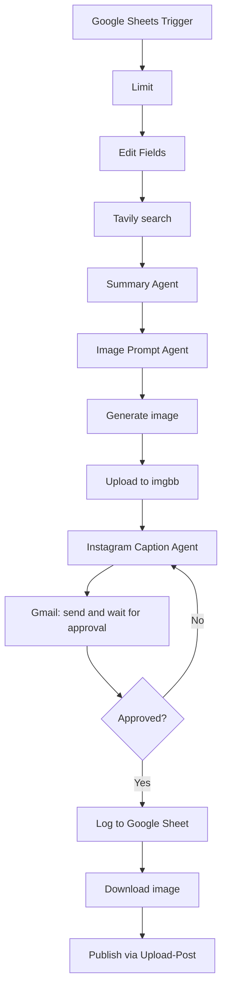

# AI Social Media Content Workflow with Human Approval (n8n)

An end-to-end automation built in **n8n**. A news link added to a Google Sheet becomes a researched summary, an AI-generated image and an Instagram caption. Nothing is published until a human clicks **Approve**.

> **AI executes. Humans decide.**

**Demo:** [Watch the LinkedIn walkthrough](https://lnkd.in/p/dpt_nkNd)

## What it does

1. **Trigger:** a new row with a news link is added to a Google Sheet.
2. **Research:** Tavily searches and pulls the article content.
3. **Summary:** an AI agent writes a short summary of the article.
4. **Image:** a second agent writes an image prompt, and OpenAI generates the image.
5. **Hosting:** the image is uploaded to imgbb to get a public link.
6. **Caption:** a third agent writes an Instagram caption in a fixed brand voice.
7. **Human review:** Gmail sends the caption, image link and source with **Approve** and **Decline** buttons, and the workflow waits.
8. **Decision:** on **Approve**, the post is logged to a Google Sheet and published to Instagram through Upload-Post. On **Decline**, the caption agent writes a new caption and sends it for review again.
9. 

## Workflow diagram

## Tech stack

- n8n (self-hosted)
- OpenAI (chat models and image generation)
- Tavily (web search)
- Google Sheets and Gmail (OAuth2)
- imgbb (image hosting)
- Upload-Post (Instagram publishing)

## Setup

1. In n8n, choose **Import from file** and select `social-media-approval-workflow.json`.
2. Connect your own credentials: Google Sheets (trigger and action), Gmail, and OpenAI.
3. Replace the placeholders in the workflow:
   - `YOUR_GOOGLE_SHEET_ID` and `YOUR_SHEET_TAB_NAME` in both Google Sheets nodes
   - `your-email@example.com` in the Gmail node
   - `YOUR_TAVILY_API_KEY`, `YOUR_IMGBB_API_KEY` and `YOUR_UPLOAD_POST_API_KEY` in the HTTP Request nodes
   - the Upload-Post `user` value, which must match your Upload-Post profile name
4. Set up your input sheet with a column named **News Link**. The workflow reads the column name with a leading space (`' News Link'`), so match your header or edit the expression.
5. Create an output tab with the columns **Post** and **Image**.
6. If you open the approval email on another device, n8n needs a public URL (for example a tunnel or a hosted n8n) so the Approve and Decline links work.

Never commit real API keys. Use n8n credentials wherever possible.

## Known limitations

- Built and tested as a learning project on a test Instagram account.
- The **Image** column in the output sheet stores an internal n8n file ID, not the public image link.
- Upload-Post does not accept photo posts to YouTube, so only Instagram is supported.
- The summary prompt mentions both a 60-word and a 35-word limit and should be cleaned up.

## Next improvements

- Store the public image link in the output sheet
- Add more platforms that accept photos
- Add a second email confirming the post went live
- Adapt the workflow for a real business use case

## Author

**Muhammad Abdullah Khan** - Software Engineering student building agentic AI workflows.
[LinkedIn](https://www.linkedin.com/in/mak-agenticai)

## License

MIT
